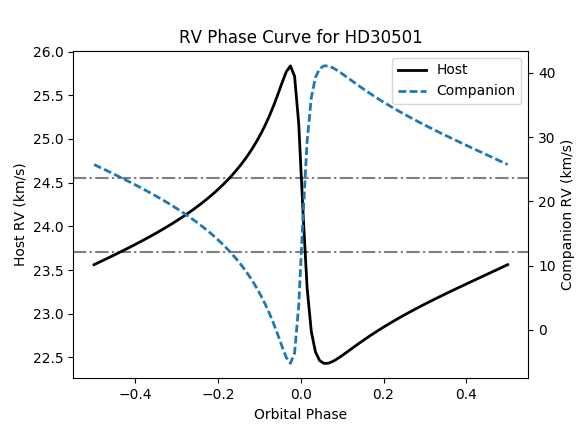

===============
Radial Velocity
===============

The ``rv.py`` script allows you to perform radial velocity calculations and create radial velocity plots to aid in planning of radial velocity observations.

Parameter file
--------------
``rv.py`` requires a parameter file to specify the orbital parameters of the system you wish to analysis. A template is provided in ``data/template_params.txt``. Comment lines starting with ``#`` are ignored as well as ends of lines after a ``#``.

For a basic rv calculation the standard rv parameters are required, ``k1`` [km/s], ``omega`` [deg], ``eccentricity``, ``tau`` [days], ``period`` [days], as well as the ``name`` parameter.

If the mean system rv offset, ``mean_val`` (usually gamma), is not provided in the parameter file it is set to 0 km/s. The ``ignore_mean`` keyword in some functions can also be used to use a 0 km/s mean_val.

To include the rv of a companion the parameters ``m_star`` (star mass) and ``msini`` or ``m_true`` (companion mass) are required or ``k2`` the semi-major amplitude of the companion.
If ``k2`` is not provided it is calculated from ``k1`` and the star and companion masses.

.. note::
    A future version could maybe have the option to obtain parameters from planetary databases such as `exoplanet.eu <http://exoplanet.eu/>`_. Although this functionality would be limited to the stars/planets of the databases.

Usage examples
==============
Simple usage cases:

::

    python rv.py data/HD30501_params.txt

displays the phase curve of HD30501 and its companion.

::

    python rv.py data/HD30501_params.txt -l data/HD30501_obs.txt -m time

Will create a temporal RV curve, marking the locations of the observations provided in the observation list file.

.. image:: time_curve.png
   :height: 400 px
   :width: 600 px
   :scale: 90 %
   :alt: Radial velocity curve, with observations indicated.
   :align: center

Modes
======
Different functionally can be accessed from the modes flag. ``-m``, or ``--mode``.

phase (default)
---------------
Produces the RV phase curve of the system between a phase -0.5 and 0.5.
If the ``k2`` parameter is provided or the mass of the host (``m_host``) and companion (``msini`` or ``m_true``), then the RV for the companion is plotted on the second y-axis.

time
-----
Produces a temporal RV curve of the system over one phase beginning today.

The ``-d``, ``--date`` flag can be used to specify a different reference date for the ``time`` mode.

If observations dates are provided with the ``-o``, or  ``-l`` flags then the curve starts from the earlier of the reference date and the first observation and continues till one period after the reference date.

debug
-----
You can turn on debugging information using the ``--debug`` flag, e.g.::

    python rv.py data/HD30501_params.txt -l data/hd30501_obs.txt --debug
