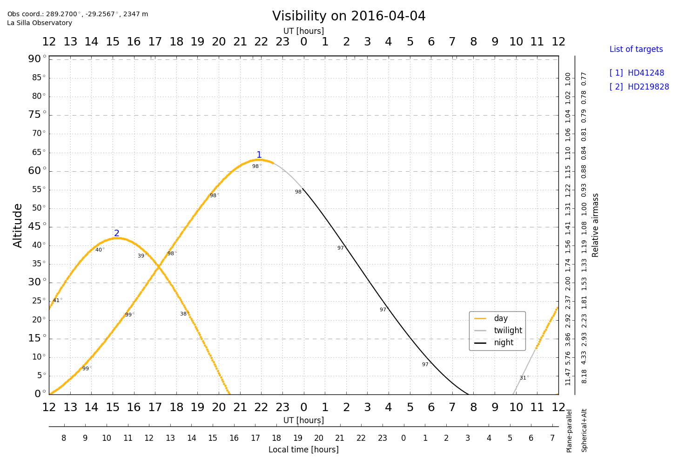
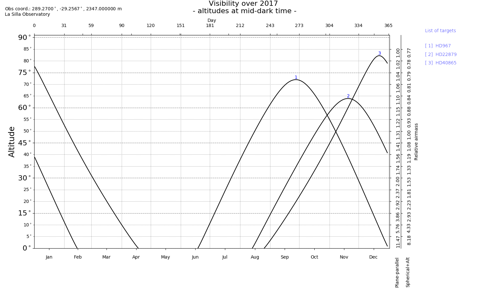

==========
Visibility
==========

The script ``visibility.py`` is used to plot the observability of objects to aid the planning of astronomical observations. It is inspired by `STARALT <http://catserver.ing.iac.es/staralt/>`_ and `PyAstronomy's Transit Visibility <http://www.hs.uni-hamburg.de/DE/Ins/Per/Czesla/PyA/PyA/pyaslDoc/aslDoc/transitVisibility.html>`_ tools.

Modes
======
Currently there are two user modes of visibility. ``staralt`` (default) and  ``starobs``. The usage of these is outlined in the following sections.

staralt
-------
The ``staralt`` mode displays the altitude verse time of targets for a particular night.

For example::

    python visibility.py HD41248,HD219828 -s esolasilla -d 2016-04-21

Results in the following image.

It is the default mode if no mode is specified. If the ``-d``, or ``--date`` is not provided with the ``YYYY-MM-DD`` format is then it defaults to today/.

The `observatory location <http://www.hs.uni-hamburg.de/DE/Ins/Per/Czesla/PyA/PyA/pyaslDoc/aslDoc/observatory.html>`_ can be specified using the ``-s`` or ``--site`` flag. The defualt observatory is ESO
To find the list of available observatories and name codes run::

    from __future__ import print_function, division
    from PyAstronomy import pyasl
    # List all available observatory data
    pyasl.listObservatories()

starobs
-------
The ``starobs`` mode shows how the altitude, at the *mid-dark time*, of each target changes over the course of the year. e.g.
::

    python visibility.py HD967,HD22879,HD40865 -m starobs

Only the year `YYYY` is to be specified for the ``--date`` flag in this mode.

Other options
==============
coordinates
------------
The `-c` flag can be used to just return the coordinates of the targets in STARALT format then exit.
